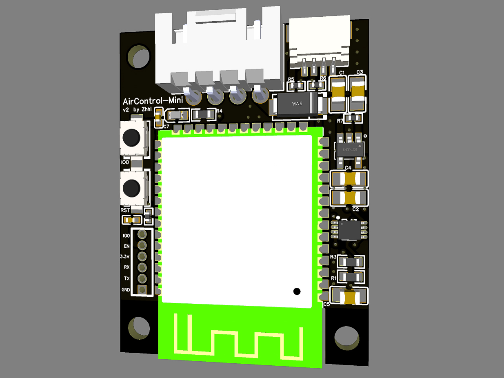

# AirControl-Mini
The smallest open source air conditioner wifi module that works locally without the cloud.

## Features
- **Local Control**: Control AC directly with Home Assistant, ESPHome or MQTT.
- **ESPHome Integration**: Easily integrates with ESPHome for home automation setups.
- **Compact Design**: Small PCB footprint (3.7cm x 2.8cm) suitable for space-constrained installations.
- **Live Reports Support**: Receive live reports and current state from the AC.
- **UART Communication**: Control air conditioner via UART interface.
- **I2C Expansion Port**: Works with SparkFun's Qwiic and Adafruit's STEMMA QT (3.3V Only) sensors
- **ESPFlash Pin Format**: Programming pin adheres to the [ESPFlash](https://github.com/SuperHouse/ESPFlash) convention.
- **Open-source Hardware and Firmware**: Both the hardware design and the firmware are fully open-source.

## Supported Modules
| **Module** | **Picture** | **AC Connector** |
| ---------  | ----------- | ---------------- |
| Panasonic CZ-TACG1 |  | CN-CNT |
| Panasonic DNSK-P11 |  | CN-WLAN |

## Hardware Specification
- **Microcontroller:**
   - ESP32-S3
- **Power:**
   - TLV755P: High-performance LDO
- **UART Communication:**
   - TXU0202: UART level shifting and protection 
- **I2C Expansion Port:**
   - JST SH Connector: Compatible with SparkFun's Qwiic and Adafruit's STEMMA QT (3.3V Only) sensors
- **Buttons:**
   - RST (Reset)
   - IO0 (Boot)
- **LED Indicators:**
   - Blue LED: Indicates communication status

------------------

## Getting Started
### Prerequisites:
1. AirControl-Mini.
2. USB-to-serial adapter for programming.
3. A compatible air conditioner that uses one of the supported module.

## ESPhome YAML
The firmware is based on [esphome-panasonic-ac](https://github.com/DomiStyle/esphome-panasonic-ac).

```yaml
esphome:
  name: AirControl-Mini
  friendly_name: AirControl-Mini
  project:
    name: "Zhhi.AirControl-Mini"
    version: "2.0"

esp32:
  board: esp32-s3-devkitc-1
  framework:
    type: arduino

wifi:
  ssid: !secret wifi_ssid
  password: !secret wifi_password

logger:
  level: DEBUG

api:
  encryption:
    key: !secret api_encryption_key

ota:
  platform: esphome
  password: !secret ota_password

# Requires ESPHome 1.15.0+ for the even parity option
uart:
  tx_pin: GPIO17
  rx_pin: GPIO16
  baud_rate: 9600
  parity: EVEN

external_components:
  source: github://DomiStyle/esphome-panasonic-ac
  components: [panasonic_ac]

climate:
  - platform: panasonic_ac
    # For CZ-TACG1
    # type: cnt

    # For DNSK-P11
    # type: wlan

    name: Panasonic AC
    horizontal_swing_select:
      name: Panasonic AC Horizontal Swing Mode
    vertical_swing_select:
      name: Panasonic AC Vertical Swing Mode
    outside_temperature:
      name: Panasonic AC Outside Temperature

    # Enable as needed
    # eco_switch:
    #   name: Panasonic AC Eco Switch
    # econavi_switch:
    #   name: Panasonic AC Econavi Switch
    # nanoex_switch:
    #   name: Panasonic AC NanoeX Switch
    # mild_dry_switch:
    #   name: Panasonic AC Mild Dry Switch
    # current_power_consumption:
    #   name: Panasonic AC Power Consumption

    # Useful when the ac does not report a current temperature (CZ-TACG1 only)
    # current_temperature_sensor: temperature_sensor_id
```

## Setting supported features
Since Panasonic ACs support different features you can comment out the lines at the bottom of your `aircontrol-mini.yaml`:

```
  # Enable as needed
  # eco_switch:
  #   name: Panasonic AC Eco Switch
  # nanoex_switch:
  #   name: Panasonic AC NanoeX Switch
  # mild_dry_switch:
  #   name: Panasonic AC Mild Dry Switch
  # econavi_switch:
  #   name: Econavi switch
  # current_power_consumption:
  #   name: Panasonic AC Power Consumption
```

In order to find out which features are supported by your AC, check the remote that came with it. Please note that eco switch and mild dry switch are not supported on DNSK-P11.

**Enabling unsupported features can lead to undefined behavior and may damage your AC. Make sure to check your remote or manual first.**\
**current_power_consumption is only an ESTIMATED value by the AC**
